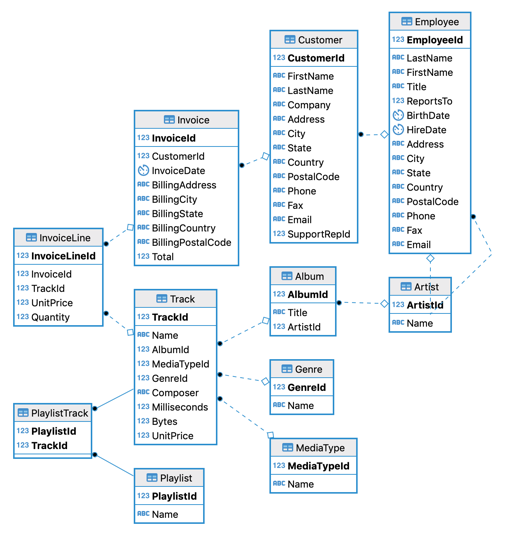

# 🎵 Chinook Music Store Data Analysis using SQL
### Comprehensive SQL Analysis of the Chinook Digital Media Store

---

## 📝 Project Overview
This project provides a comprehensive analysis of the **Chinook** database, representing a digital media store. The goal is to extract valuable insights to understand sales performance, customer behavior, and music content trends using **SQL**.

The analysis uses the well-known **Chinook Sample Database**, which includes tables for Invoices, Customers, Employees, and Tracks.

---

## 🚀 Key Business Questions Addressed
The analysis provides data-driven answers to several critical business questions, including:
- **Revenue Analysis:** Which countries generate the highest revenue? How does monthly revenue fluctuate over time?
- **Customer Behavior:** Who are the top-spending customers? What is the percentage of inactive customers?
- **Product Performance:** Which music genres are the most popular? Does track duration correlate with sales?
- **Employee Performance:** Which support agents are most effective in terms of customer management and sales generation?

---

## 🛠️ Tools Used
- **Language:** SQL (SQLite Dialect).
- **Dataset:** Chinook Sample Database.
- **Reporting:** Microsoft PowerPoint (for final presentation).
- **Visualization:** ER Diagram for database schema understanding.

---

## 📁 Project Structure
The repository is organized for easy navigation:

| File | Description |
| :--- | :--- |
| 📄 [ChinookSQL.sql](./ChinookSQL.sql) | Contains all SQL queries used in the analysis |
| 📊 [Chinook_Analysis.pptx](./Chinook_Analysis.pptx) | Presentation summarizing findings and recommendations |
| 🖼️ [assets/chinook-er-diagram.png](./assets/chinook-er-diagram.png) | ER Diagram showing database table relationships |

---

## 🔍 Database Schema (ER Diagram)
Below is the visual representation of how the data is interconnected:

  

---

## 💻 How to Get Started
To run the queries locally:
1. Download the **Chinook** database in `.sqlite` format.
2. Use any SQL editor (e.g., DB Browser for SQLite or VS Code with SQL extension).
3. Open `ChinookSQL.sql` and execute the queries.

---

## 💡 Key Insights & Recommendations
Based on the analysis, several key findings were identified:
- **Geographical Focus:** The USA and Canada account for the largest share of sales, suggesting a need for localized marketing.
- **Customer Retention:** A significant percentage of customers have been inactive for over a year; targeted promotional offers are recommended.
- **Content Optimization:** Certain genres drive high sales despite having fewer available tracks, indicating an opportunity to expand those collections.

---

## 👤 Contact
Feel free to reach out if you have any questions or would like to discuss the results:

---

Made precise data insights.

